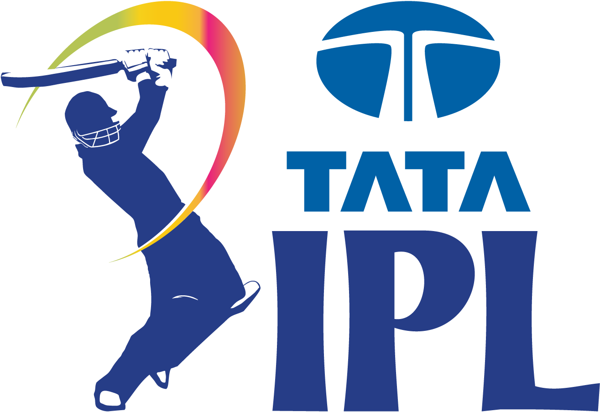

# 🏏 IPL 2025 Live Stats Dashboard

A fully automated, real-time IPL statistics dashboard built with **Streamlit**, **MySQL**, and **CricAPI**, offering live scorecards, league stats, points tables, team insights, and more — all styled in an engaging dark theme.



---

## 🚀 Features

### 📅 Home Dashboard
- View today’s matches with venue details
- Highlights top performers (Orange & Purple Cap)
- Quick summary of match count, teams, and statuses

### 📈 Match Scoreboard
- Match-wise innings breakdown
- Toss winner, match result, detailed batting & bowling cards
- Stylish scorecard visuals with team colors/logos

### 📊 League Stats
- Switch between **Batting** and **Bowling** via sidebar
- Tabs include:
  - Most Runs, High Scores, Strike Rate, Centuries, Fifties, Sixes, Fours
  - Most Wickets, Best Economy, Best Average, 5W hauls

### 🏆 Points Table
- Dynamically computed points with real-time NRR
- HTML-styled table with team logos

### 🧢 Team Squads
- Select team and filter by **All / India / Overseas**
- Players grouped by role (Batsman, Bowler, All-rounder, WK)
- Expandable views for each section

### 📊 Team Performance
- Per-team insights: Batting & Bowling stats
- MVP Impact Score = `Runs + (Wickets × 20)`
- Composition by role and nationality
- Top scorers and wicket-takers with visual charts

---

## 🔄 Automation

### 📡 Data Fetching Engine
- File: `incremental_fetcher.py`
- Fetches yesterday’s completed matches from CricAPI
- Parses and stores:
  - Match metadata
  - Innings summary
  - Full scorecards (batting, bowling, fielding)
  - Points table
- Can be scheduled via GitHub Actions / cron jobs

---

## 🧩 Tech Stack

| Layer         | Tech/Tool           |
|---------------|---------------------|
| Frontend      | Streamlit (Python)  |
| Backend       | Python, SQLAlchemy  |
| Database      | MySQL               |
| API           | CricAPI             |
| Styling       | HTML, CSS (Dark Mode), Pandas `.style` |
| Deployment    | Streamlit / Docker / GitHub Actions |

---

## ⚙️ Setup Instructions

### 🛠️ Prerequisites
- Python 3.8+
- AWS RDS
- MySQL database running
- API Key from [CricAPI](https://www.cricapi.com/)

---

## 🧠 Project Structure

```
├── Home.py
├── 1_Scoreboard.py
├── 2_League_Stats.py
├── 3_Points_Table.py
├── 4_Sqauds.py
├── 5_Team_Performance.py
├── db_connection.py
├── database.py
├── queries.py
├── squad_queries.py
├── style_config.py
├── incremental_fetcher.py
├── config.py
├── requirements.txt
├── requirements_fetcher.txt
└── data/
    └── IPL_2025_Match_List.csv
```

---

## 🌟 Future Enhancements
- 🔎 Player profiles with career stats
- 🤖 Chatbot for live stat Q&A
- 📊 PowerBI integration for interactive visual dashboards
- 🕹️ Season-wise trend analytics
- 🌐 Mobile-friendly responsive view

---

## 🤝 Credits
- Data API: [CricAPI](https://www.cricapi.com/)
- Icons: [Icons8](https://icons8.com/)
- UI/UX Inspiration: IPL Official Website

---

## 📢 License
This project is for educational and demonstration purposes only. Not affiliated with BCCI or IPL.

---

Made with ❤️ by [Sourabh R](https://github.com/SourabhR23)